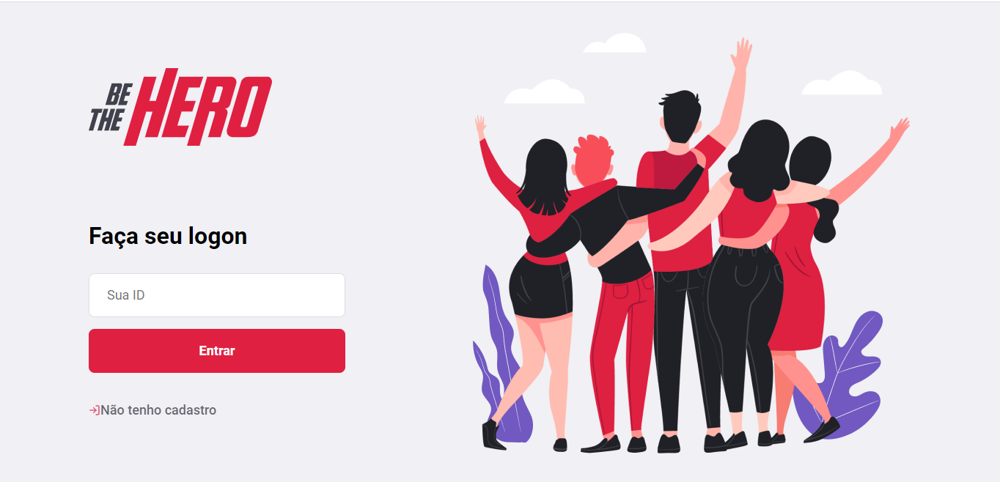
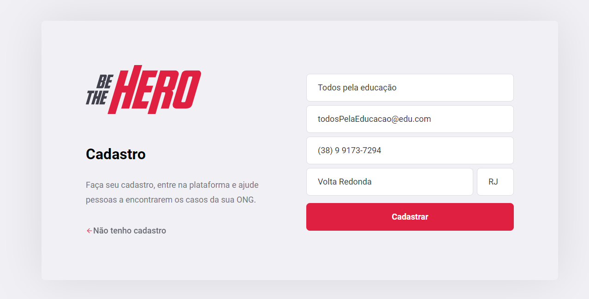
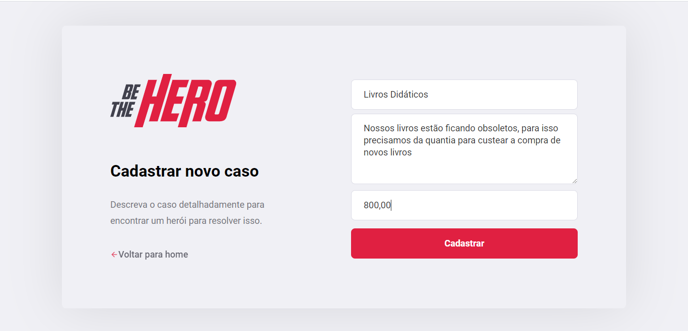
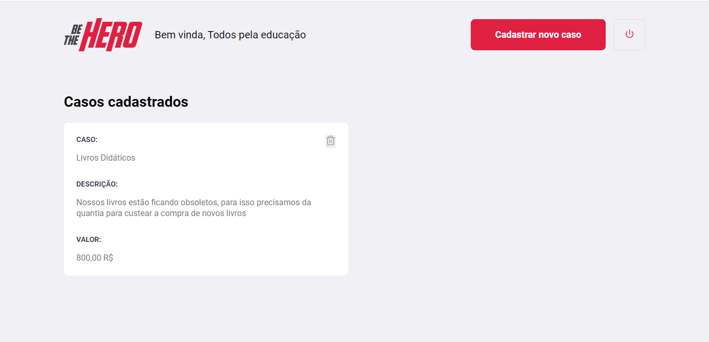
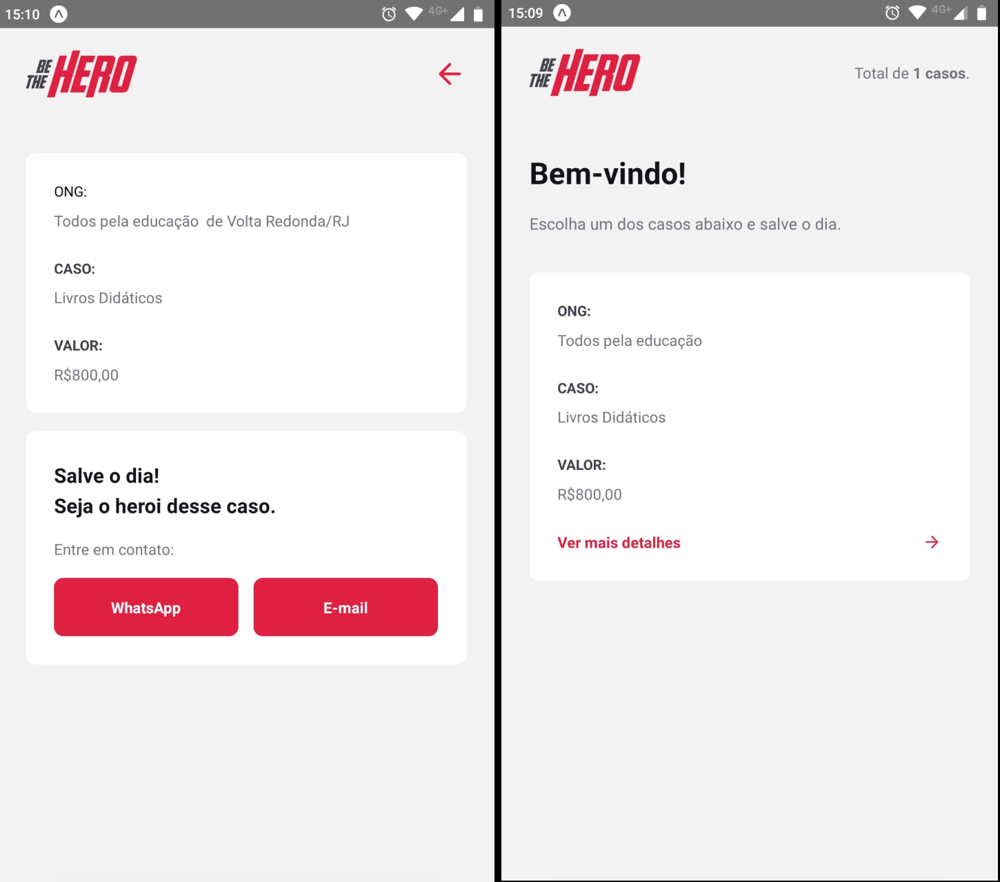

# Be The Hero

## Objetivos

O projeto, desenvolvido durante a semana Omnistack, proporciona a facilidade na coleta de doações, sendo voltada especialmente para ONG's.

## Tecnologias / bibliotecas

Algumas dependencias que foram utilizadas no projeto.

- [node](https://nodejs.org/en/)
- [axios](https://github.com/axios/axios)
- [celebrate](https://github.com/arb/celebrate)
- [cross-env](https://www.npmjs.com/package/cross-env)
- [express](https://expressjs.com/pt-br/)
- [knex](http://knexjs.org/)
- [sqlite](https://www.npmjs.com/package/sqlite3)
- [react](https://pt-br.reactjs.org/)
- [react-native](https://reactnative.dev/)
- [expo](https://expo.io/)
- [react-native-community/masked-view](https://www.npmjs.com/package/@react-native-community/masked-view)
- [react-native-reanimated](https://docs.swmansion.com/react-native-reanimated/docs/1.x.x/getting_started)
- [react-icons](https://react-icons.github.io/react-icons)
- [nodemon](https://www.npmjs.com/package/nodemon)
- [supertest](https://www.npmjs.com/package/supertest)

## Iniciando projeto

### Alterando rota do servidor

Para executar o projeto corretamente, defina primeiro qual sera o IP em que o servidor estará rodando.
<br>
Vá ate os diretorios

```
Projeto web: frontend\src\services\api.js
Projeto mobile: mobile\src\Services\api.js
```

e altere o valor 192.168.100.5 para o valor que você pode encontrar digitanto ipconfig no seu terminal.

### Preparando projeto

precisamos rodar as migrations para que o projeto funcione corretamente.
<br>
Execute no seu ternimal o comando:

```
    npx knex migrate:latest
```

para configurar todas as tabelas.
<br><br>
Execute um teste inicial para verificar um possivel erro com o comando:

```
    npm teste
```

<br><br>
Inicie o servidor com o comando:

```
    npm start
```

### Images

Estas são algumas images que foram tiradas do projeto







### Rotas do servidor

- \ongs

```JSON
POST Request:
{
	"name":"me salva",
	"email":"contact@mesalva.com",
	"whatsapp":"0000000000",
	"city":"Vitória",
	"uf":"ES"
}
```

```JSON
POST Response:
{
  "id": "02961875"
}
```

```JSON
GET Response:
[
  {
    "id": "02961875",
    "name": "me salva",
    "email": "contact@mesalva.com",
    "whatsapp": "0000000000",
    "city": "Vitória",
    "uf": "ES"
  }
]
```

- \sessions

```JSON
GET Request:
{
    "id": "02961875"
}
```

```JSON
GET Response:
{
  "name": "me salva"
}
```

- /profile

```
headers: {'Content-Type': 'application/json',authorization: '02961875'}
```

- \incidents

```JSON
GET Request:
{
	"page":1
}
```

```JSON
GET Response:
[
  {
    "id": 1,
    "title": "cachorros famintos",
    "description": "Nossa cidade possui muitos cachorros sem um lar, precisamos alimentar-los e para isso, pedimos uma quantia justa",
    "value": 10000,
    "ong_id": "02961875",
    "name": "me salva",
    "email": "contact@mesalva.com",
    "whatsapp": "0000000000",
    "city": "Vitória",
    "uf": "ES"
  }
]
```

- \incidents:

```JSON
GET Request:
{
	"title":"cachorros famintos",
	"description":"Nossa cidade possui muitos cachorros sem um lar, precisamos alimentar-los e para isso, pedimos uma quantia justa",
	"value":"10000"
}
```

```JSON
GET Response:
{
  "id": 1
}
```

- /incidents/1

```
GET Response: STATUS 204
```
